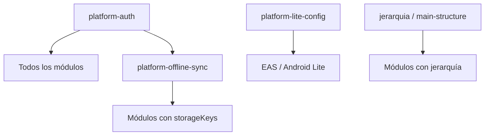

# ARCHITECTURE — test-soft-001 (Lite)

> Actualizado por Fase 2 (`@soft-release-expert`). Solo lectura — no modificar app desde aquí.

## Baseline

| Campo | Valor |
|-------|-------|
| Rama | `test-soft-001` |
| Tag | `soft-001-baseline` |
| Variante objetivo | **Lite** (`APP_VARIANT=lite`) |
| Package Android (config) | `com.abrjpo98.MonitoreApp.lite` |
| EAS profile | `preview-lite` |
| Módulos in-scope | 41 (manifest) |

## Stack

| Capa | Tecnología |
|------|------------|
| Mobile | Expo 54, RN 0.81, React Navigation (`App.tsx` entry) |
| Server | Next.js 15 App Router, Prisma/MySQL |
| Auth móvil | JWT access + refresh (AsyncStorage) + token Planillas separado |
| BFF | `/api/*` → Prisma / `dynamic-prisma` / Planillas API |
| Offline | Colas `*_actions` en AsyncStorage, sync en `App.tsx` (~8600 LOC) |
| Push | expo-notifications + Firebase Admin (server) |
| Jerarquía | `main-structure` fragmentado + caches locales |
| Feature flags | `n_app_module_visibility` → `/api/modules-release` → `SlideMenu` |

## Flujo de autenticación (dual)

```
LoginScreen → POST /api/auth/login
  ├─ JWT access + refresh (24h mobile lifetime via MINUTES_LIFE_TIME_TOKEN)
  ├─ planillasToken + planillasTokenExpiresAt (obligatorio; login falla si falta)
  └─ dynamic-prisma/auth/login (sesión server)

Requests autenticados:
  authedFetch → getValidAccessTokenOrLogout (preflight refresh)
    ├─ offline (getValidAccessTokenOrLogout): return null SIN logout
    └─ 401/403 response: logout inmediato (INTENCIONAL)

Sync con Planillas:
  planillasPendingActions → modal revalidación → planillas_token en colas
```

**Nota:** Existe `authTokenStorage.ts` con modo `planillas`/`legacy` (sesión Planillas como access token) paralelo al flujo JWT en `AuthContext`. Revisar coherencia en fixes.

## Flujo offline/sync

```
eventBus 'syncCachesRequested' | reconexión | foco app
  → syncPendingActionsIfOnline (mutex global getSyncCachesSlot)
  → resolveAppConnectivity()
  → getValidAccessTokenOrLogout (puede abortar sync si null)
  → requestPlanillasTokenForSyncIfNeeded()
  → check*ActionsCache (secuencial + Promise.all mixto)
```

**Colas:** 27 keys en `ACTION_STORAGE_KEYS` (App.tsx ~570).

## Hooks compartidos (riesgo cruzado)

| Hook | Consumido por |
|------|----------------|
| `evaluationFunctions.ts` | permit-request, traslado-plazas, acta-entrega, corporate-vehicles |
| `authedFetch.ts` | Todos los módulos online |
| `mainStructureApi.ts` | jerarquia + módulos con pickers |
| `getHoraAccion.ts` | auth expiry, Planillas token, marcas |

## Convenciones

| Capa | Patrón |
|------|--------|
| Pantalla | `apps/mobile/screens/{Name}Screen.tsx` |
| Lógica | `hooks/{module}Functions.ts`, `*CacheHelpers.ts`, `*Sync.ts` |
| API | `apps/server/app/api/{kebab-case}/` |
| Reportes | `server/utils/reports-functions/` |

## Comportamiento intencional (NO cambiar)

- Logout en 401/403 vía `authedFetch` (sin retry)
- Token Planillas obligatorio en login
- Integración Planillas existente (no rediseñar)

## Lite — configuración

| Artefacto | Lite | Estado baseline |
|-----------|------|-----------------|
| `app.config.js` | `APP_VARIANT=lite` → package `.lite` | OK en config |
| `google-services-lite.json` | Existe | OK |
| `android/app/build.gradle` | Hardcoded `.full` | **Desalineado** |
| `MainActivity.kt` | Solo `full/` | **Desalineado** |
| `eas.json` | `preview-lite` | OK |

## Orden de revisión Fase 2–4

1. ~~platform-auth~~ → adversarial_done
2. ~~platform-offline-sync~~ → adversarial_done
3. ~~platform-lite-config~~ → adversarial_done
4. marcar-ingreso-salida → lunch-time → puesto-ubicacion → …
5. reportes (último)

## Mapa dependencias transversales



## Referencias

- `.cursor/review/modules-manifest.json`
- `.cursor/review/findings/platform-*/`
- `ESTATUS_PROYECTO.md`, `ARCHIVOS_SIN_REFRESH_TOKEN_401_403.md`
